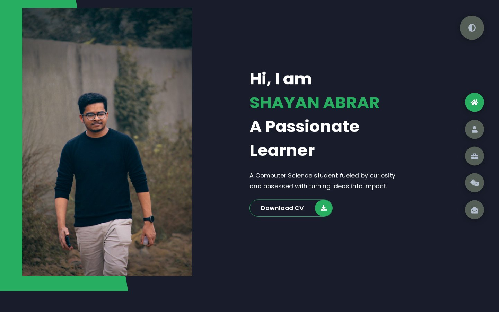
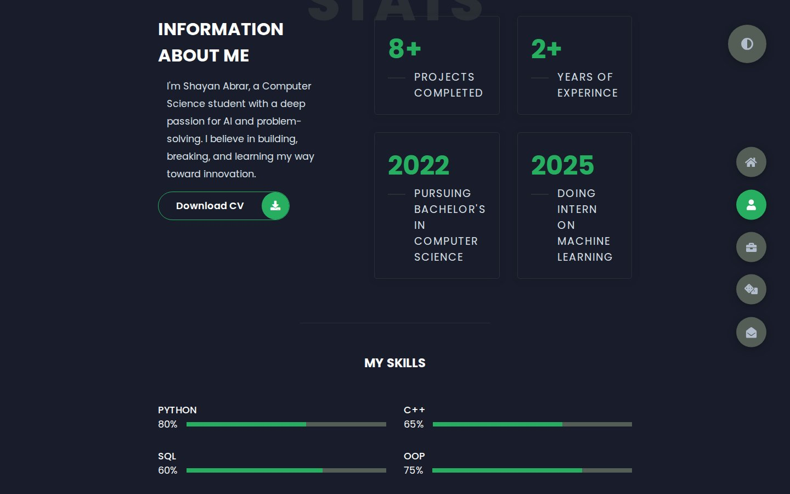
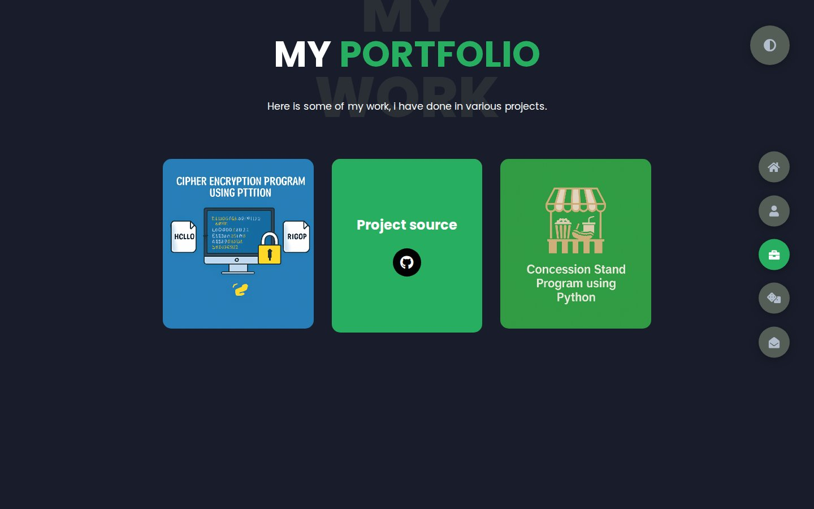
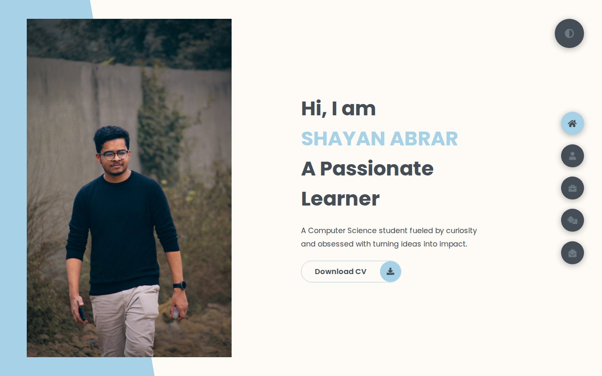

# Shayan Abrar Portfolio (Previous Version)

My earlier single-page portfolio: full-screen sections switched from a side menu, a dark and light theme and a Snakes & Ladders game against the computer.

> My current portfolio is at **[shayan-abrar.vercel.app](https://shayan-abrar.vercel.app)** ([source](https://github.com/SHAYAN-ABRAR/Shayan-Portfolio-Website)).

**Live site:** <https://shayan-abrar.github.io/Shayan-Portfolio-Old/>

<p align="center">
  
</p>

<table>
  <tr>
    <td align="center" width="25%"><a href="screenshots/preview.jpg"></a><br><sub><b>Home</b> · dark theme</sub></td>
    <td align="center" width="25%"><a href="screenshots/about.jpg"></a><br><sub><b>About</b> · stats and skills</sub></td>
    <td align="center" width="25%"><a href="screenshots/portfolio.jpg"></a><br><sub><b>Portfolio</b> · project links</sub></td>
    <td align="center" width="25%"><a href="screenshots/light-theme.jpg"></a><br><sub><b>Light theme</b></sub></td>
  </tr>
</table>

A personal site has to introduce you, show your skills and point to your work without making visitors dig. This version gives each topic its own full-screen section and switches between them with a fixed menu, so there are no page loads. Its colors are CSS custom properties that a single class swaps for the light theme, and the styles are written in Sass.

## Quick Start

```bash
git clone https://github.com/SHAYAN-ABRAR/Shayan-Portfolio-Old.git
cd Shayan-Portfolio-Old
python3 -m http.server 8000
```

Open <http://localhost:8000> for the portfolio and <http://localhost:8000/game.html> for the game. On Windows, use `python` instead of `python3`. Opening `index.html` directly in a browser works too. Font Awesome, the Poppins font, GSAP and the game's board and dice images load from the internet.

## Features

- **Section menu:** Home, About, Portfolio and Contact are full-screen sections. The round buttons on the right switch between them with a scale-in animation and no page reload. At 970px and narrower, the buttons move to a bar along the bottom of the screen.
- **Dark and light themes:** the button at the top right toggles a `light-mode` class that swaps the color variables.
- **About:** a short bio, four stat cards, skill bars for Python, C++, SQL and OOP, and an education timeline.
- **Portfolio:** three project images. Hovering one shows a GitHub link to that project's source code.
- **Contact:** location, email, phone and social links next to a message form.
- **Snakes & Ladders (`game.html`):** you play against "AutoBot", which rolls for itself. The canvas board has 8 ladders and 7 snakes, the dice roll is animated, tokens walk square by square and GSAP animates the slides along snakes and ladders. The first player to reach square 100 wins, and **Play Again** resets the board.

## Customizing the Theme

Both themes are defined as CSS custom properties at the top of `styles/styles.scss`. The dark theme is the `:root` block, and `.light-mode` overrides the same variables:

```scss
 .light-mode{
  --color-primary: #FEFBF6;
        --color-secondary: #A6D1E6;
        --color-white  : #454e56;
```

`index.html` loads the compiled `styles/styles.css`, so recompile it after editing, for example with `npx sass styles/styles.scss styles/styles.css`. The committed CSS doesn't match the SCSS exactly: recompiling adds a grayscale filter to the home photo (it turns to color on hover) that the current CSS doesn't have.

## Limitations

- The **Download CV** buttons link to `Shayan CV.pdf`, but the file in the repository is named `Shayan CV 1.pdf`, so they open a 404 page, including on the live site.
- The contact form doesn't send anything. Its only button is another link to the CV.
- Clicking the dice button outside its small icon hides every section, because its `data-id="game"` has no matching section. The page stays blank until you click another section button.
- On phones, the portfolio stays in two narrow columns: the 1,070px media query comes after the 600px one in `styles/_media.scss` and overrides it.
- The theme choice isn't saved between visits, and `img/myPic.jpg` is a 6 MB, 3456 × 5184 photo, so the home section loads slowly on mobile data.

## Tech Stack

- HTML5
- Sass (SCSS) compiled to `styles/styles.css`, with CSS custom properties and media queries
- Vanilla JavaScript: `app.js` for sections and the theme, `script.js` for the game
- HTML Canvas and GSAP 3 for the game
- Font Awesome 5.15.4 and Google Fonts: Poppins
- Hosted on GitHub Pages

## Contributing

Suggestions and bug reports are welcome. Please [open an issue](https://github.com/SHAYAN-ABRAR/Shayan-Portfolio-Old/issues). Please read the license note below before reusing any code or images.

## License

This repository doesn't have a license yet, so it doesn't grant anyone permission to reuse or redistribute its code or images. Please ask before reusing any part of it. The Snakes & Ladders page appears to be adapted from a CodePen demo: `game.html` still contains CodePen's export markers, and its board and dice images load from assets.codepen.io.

---

Built by **Shayan Abrar** · [GitHub](https://github.com/SHAYAN-ABRAR) · [LinkedIn](https://www.linkedin.com/in/shayan-abrar/)
